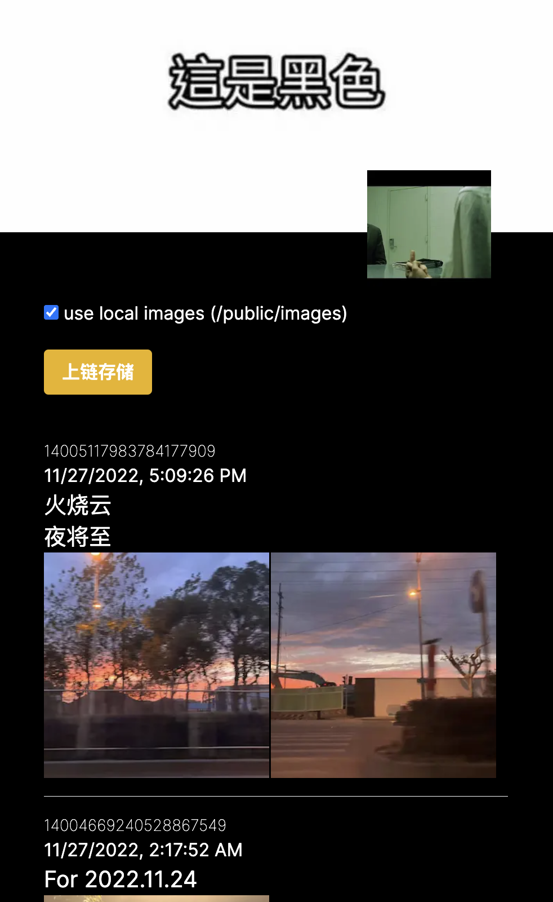
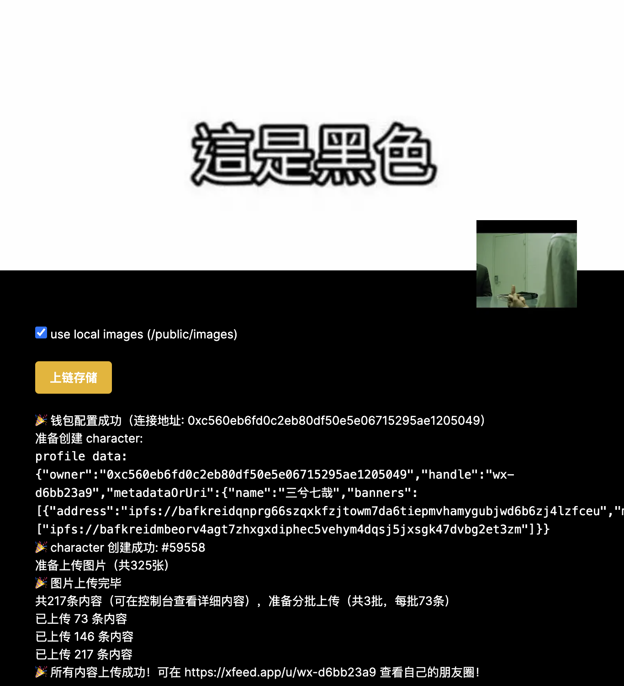

This is a project to help user migrate notes to Crossbell blockchain. For instance, you could migrate your WeChat moments(朋友圈) or qqzone feeds(说说) on Crossbell. After the migration, a new character will be created and you could see your notes on [xFeed](https://xfeed.app/).

## Getting Started

1. Prepare your notes as following structure and then convert it to json file ``moments.json``:
```typescript
interface Moments {
    account: {
        banner?: string;
        avatar?: string;
        bio?: string;
        nickname: string;
        id: string;
    };
    moments: {
        content: string;
        type: "share" | "text";
        images: string[];
        display_images?: string[];
        share_title: string;
        share_desc: string;
        share_url: string;
        share_image?: string;
        publish_time: string;
        id: string;
    };
}
```
Note: the image urls are expected to be http(s), and if you hope to backup all images as well, rather than only urls, you could put all images under ``/public/images`` with the name that are base64 encoded from the http url. 
```typescript
const localImg = `/images/${Buffer.from(imgHttpUrl).toString("base64")}.jpg`
```


2. Put ``moments.json`` in ``/public``, and then run the project locally
```bash
npm run dev
# or
yarn dev
# or
pnpm dev
```

Finally in http://localhost:3000 you will see something like:


3. Upload notes to Crossbell

If you click "use local images", as said before, the image ``/images/${Buffer.from(imgHttpUrl).toString("base64")}.jpg`` will be used for images src, and also local images will be uploaded to ipfs. If not, images src will be http(s) urls, and images will not be uploaded to ipfs.

And after clicking the "上链存储" button, follow the instructions step by step, you will finally see something like that:


Then you can go to xFeed as instructed to see your notes on Crossbell.
